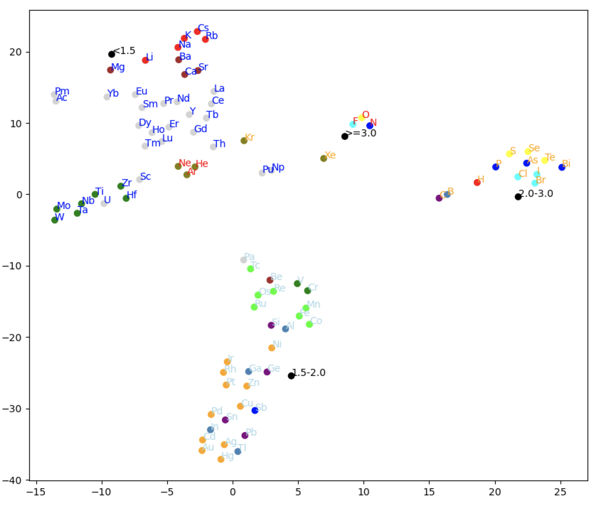
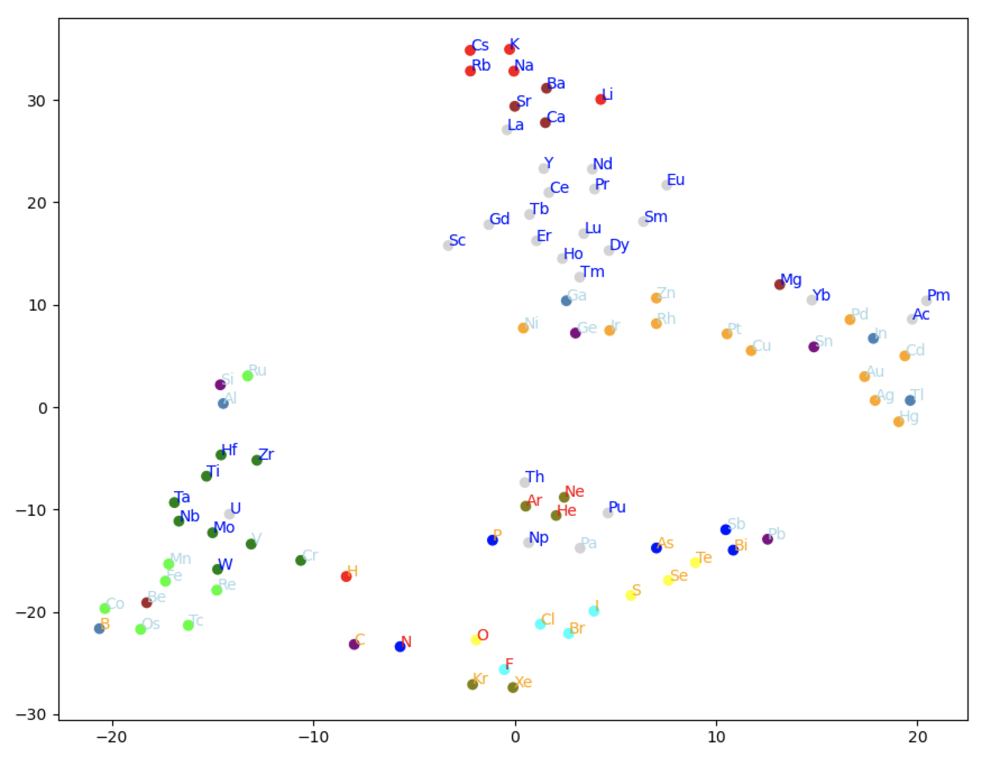

materials-sandbox
=================

Create the corpus using a graph representation of the structure of a compound and node2vec:
```
python create_lattice_graph_corpus.py
```

## GloVe Embeddings:

Build the GloVe model using the lattice graph walks corpus:
```
python build_glove_model.py --create out/all_stable_bandgap.node2vec.walks --components 20 --train 50
```
```
python plot_atom_vectors_tsne.py --model out/all_stable_bandgap_dim20.glove.model --iterations 5000 --perplexity 10 --learning-rate 10
```


## GraVe Embeddings using Atom Electronegativity:

GraVe embeddings are learned as GloVe embeddings are, except extra attributes can be associated with nodes (i.e. atoms)
as features (see attr2vec). The resulting embeddings then additionally reflect these extra features.

### Binary Features for Electronegativity Ranges:

Create the training set:
```
python create_atom_vectors_fm_training_data.py
```
Build the model:
```
python build_fm_model.py
```
```
python plot_atom_vectors_fm_tsne.py --model out/all_stable_bandgap_dim20.fm.ctx10_or_1.model --iterations 5000 --perplexity 10 --learning-rate 10
```


### Single Continuous Electronegativity Feature:

Create the training set:
```
python create_atom_vectors_fm_training_data2.py
```
Build the model:
```
python build_fm_model.py
```
```
python plot_atom_vectors_fm_tsne2.py --model out/all_stable_bandgap_dim20.fm.ctx10_add_cont.model --iterations 5000 --perplexity 10 --learning-rate 10
```


The labels for each point in the two plots above are color-coded by electronegativity:
```
>= 3.0: red
>= 2.0 and < 3.0: orange
>= 1.5 and < 2.0: lightblue
< 1.5: blue
```
