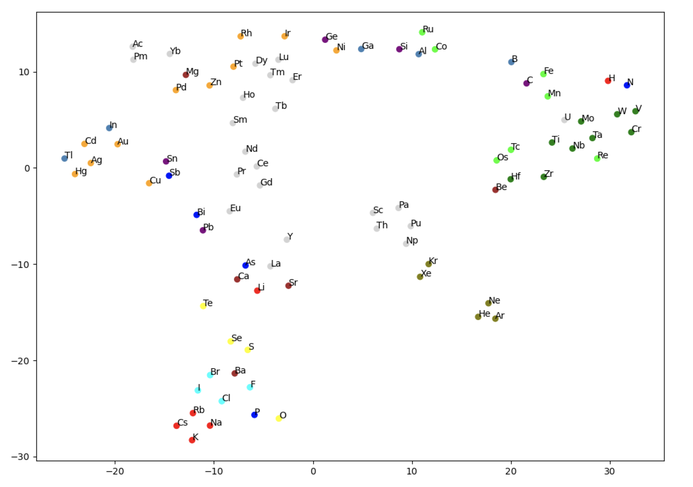

materials-sandbox
=================

```
python build_glove_model.py --create out/all_stable_bandgap.node2vec.walks --components 20 --train 50
```
```
python plot_atom_vectors_tsne.py --model out/all_stable_bandgap_dim20.glove.model --iterations 5000 --perplexity 50 --learning-rate 10
```
