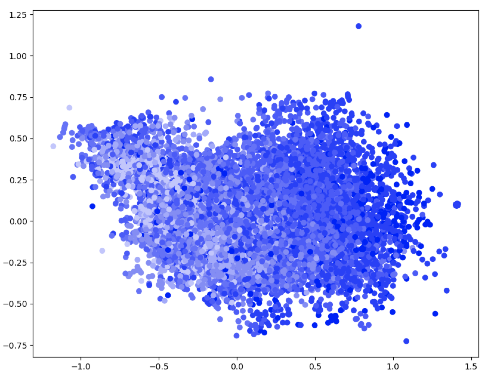

### PCA on the Mean Atom Vector for a Compound

With atom vectors in hand, one way to represent a compound (such as Bi<sub>2</sub>Se<sub>3</sub>, for example) is to 
take the mean of the atom vectors for that compound, i.e. `mean {Bi_v, Bi_v, Se_v, Se_v, Se_v}` where `Bi_v` and `Se_v` 
represent the atom vectors for Bi and Se, respectively.

It is interesting to ask if there is a relationship between this kind of representation for a compound and its band 
gap value. The following command will compute the mean atom vectors for each of the ~33,000 compounds in the 
`out/all_stable_bandgap.pkl` dataset, perform PCA on them, and plot the first two components against eachother:
```
python pca_mean_vectors.py
```

The following plot is the result:


Each point represents a compound, colored according to its band gap value, with darker points representing a lower 
value. About half of the compounds have a band gap value of 0.

The following plot is the same as above, except that the compounds where the band gap is exactly 0 have been excluded:



For each of the plots above, the GraVe embeddings that incorporate a continuous electronegativity feature were used to 
represent an atom in a compound.