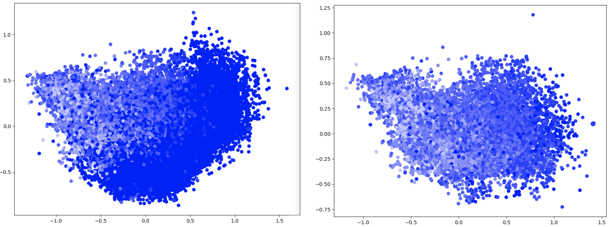

### PCA on the Mean Atom Vector for a Compound

With atom vectors in hand, one way to represent a compound (such as Bi<sub>2</sub>Se<sub>3</sub>, for example) is to 
take the mean of the atom vectors for that compound, i.e. `mean {Bi_v, Bi_v, Se_v, Se_v, Se_v}` where `Bi_v` and `Se_v` 
represent the atom vectors for Bi and Se, respectively.

It is interesting to ask if there is a relationship between this kind of representation for a compound and its band 
gap value. The following command will compute the mean atom vectors for each of the ~33,000 compounds in the 
`out/all_stable_bandgap.pkl` dataset, perform PCA on them, and plot the first two components against eachother:
```
python pca_mean_grave_vectors.py
```

The following plots are the result:



Each point represents a compound, colored according to its band gap value, with darker points representing a lower 
value. The plot on the right is the same as the one on the left, except that the compounds where the band gap is 
exactly 0 have been excluded, as about half of the compounds have a band gap value of 0.

For the plots above, the GraVe embeddings that incorporate a continuous electronegativity feature were used to 
represent an atom in a compound.

For comparison, random vectors were assigned to the elements of the dataset, and the same procedure was carried out:
```
python pca_mean_random_vectors.py
```


### Regression with the Pooled Atom Vector for a Compound to Predict Band Gap Energies

Atom vectors were pooled for each of the ~33,000 compounds in the `out/all_stable_bandgap.pkl` dataset, using either
mean pooling or max pooling, and Random Forest and MLP Regression models were trained on these pooled atom vectors and 
their corresponding band gaps. The results are displayed in the following table:

Mean Pooling:

Atom Vectors             | Dim       |  Random Forest, R<sup>2</sup>   | MLP, R<sup>2</sup> |
-------------------------|----------:|--------------------------------:|-------------------:|   
GraVe<i><sup>1</sup></i> | 20        | 0.693 ± 0.0148 (0.559 ± 0.0216) | 0.630 ± 0.0183     |
GraVe<i><sup>2</sup></i> | 20        | 0.750 ± 0.0195 (0.640 ± 0.0289) | 0.659 ± 0.0232     |
GraVe<i><sup>3</sup></i> | 40 (20+20)| 0.779 ± 0.0155 (0.677 ± 0.0205) | 0.701 ± 0.0160     |
GloVe                    | 20        | 0.705 ± 0.0122 (0.577 ± 0.0208) | 0.590 ± 0.0176     |
Random                   | 20        | 0.697 ± 0.0118 (0.561 ± 0.0186) | 0.700 ± 0.0141     |                         
One-hot                  | 89        | 0.849 ± 0.0148 (0.775 ± 0.0270) | 0.883 ± 0.0158     |

Max Pooling:

Atom Vectors             | Dim        |  Random Forest, R<sup>2</sup>   | MLP, R<sup>2</sup> | 
-------------------------|-----------:|:--------------------------------|-------------------:|   
GraVe<i><sup>1</sup></i> | 20         | 0.796 ± 0.0155 (0.701 ± 0.0176) | 0.691 ± 0.0166     |
GraVe<i><sup>2</sup></i> | 20         | 0.807 ± 0.0124 (0.729 ± 0.0158) | 0.675 ± 0.0159     |
GraVe<i><sup>2</sup></i> | 89         | 0.829 ± 0.0149                  |                    |
GraVe<i><sup>2</sup></i> | 200        | 0.829 ± 0.0132                  |                    |
GraVe<i><sup>2</sup></i> | 1000       | 0.833 ± 0.0120                  |                    |
GraVe<i><sup>3</sup></i> | 40 (20+20) | 0.815 ± 0.0116 (0.736 ± 0.0114) | 0.695 ± 0.0171     |
GraVe<i><sup>3</sup></i> | 178 (89+89)| 0.831 ± 0.0130                  |                    |
GloVe                    | 20         | 0.798 ± 0.0120 (0.708 ± 0.0118) | 0.588 ± 0.0175     |
Random                   | 20         | 0.774 ± 0.0156 (0.673 ± 0.0210) | 0.602 ± 0.0131     |                    
One-hot                  | 89         | 0.753 ± 0.0160 (0.641 ± 0.0290) | 0.825 ± 0.0155     |

<i>The Random Forest Regression model utilized 100 estimators. 
The MLP consisted of 1 hidden layer with 100 neurons, and was trained with the ADAM optimizer.
Score values represent the mean 10-fold cross-validation result.
The values in parentheses are the scores for a dataset in which the examples with a band gap of 0 were removed.</i>

<i><sup>1</sup> embeddings jointly trained with a single, continuous electronegativity feature</i> 

<i><sup>2</sup> embeddings jointly trained with electronegativity range binary features</i>

<i><sup>3</sup> embeddings jointly trained with electronegativity range binary features, and 
each atom vector was concatenated with its corresponding electronegativity range vector</i>

### Regression with Bag of Random Embedding Projections

Instead of pooling the atom vectors themselves, a random projection matrix is initialized to compute the 
compound embedding: `h = f(W*e_i)`, where `h` is the compound embedding, `f` is a pooling function, `W` is the 
projection matrix, and `e_i` is the i'th atom vector in the compound.

Max Pooling:


|Atom Vectors             | In Dim     | Out Dim | Random Forest, R<sup>2</sup> | 
|-------------------------|---------- :|--------:|-----------------------------:|   
|GraVe<i><sup>1</sup></i> | 20         | 200     | 0.827 ± 0.0183               |
|GraVe<i><sup>2</sup></i> | 20         | 200     | 0.825 ± 0.0136               |
|GraVe<i><sup>3</sup></i> | 40 (20+20) | 200     | 0.839 ± 0.0113               |
|GraVe<i><sup>3</sup></i> | 178 (89+89)| 200     | 0.836 ± 0.0107               |
|GraVe<i><sup>3</sup></i> | 178 (89+89)| 500     | 0.841 ± 0.0111               |
|GloVe                    | 20         | 200     | 0.828 ± 0.0105               |
|Random                   | 20         | 200     | 0.805 ± 0.0149               |
|One-hot                  | 89         | 200     | 0.810 ± 0.0152               |


<i><sup>1</sup> embeddings jointly trained with a single, continuous electronegativity feature</i>

<i><sup>2</sup> embeddings jointly trained with electronegativity range binary features</i>

<i><sup>3</sup> embeddings jointly trained with electronegativity range binary features, and
each atom vector was concatenated with its corresponding electronegativity range vector</i>
